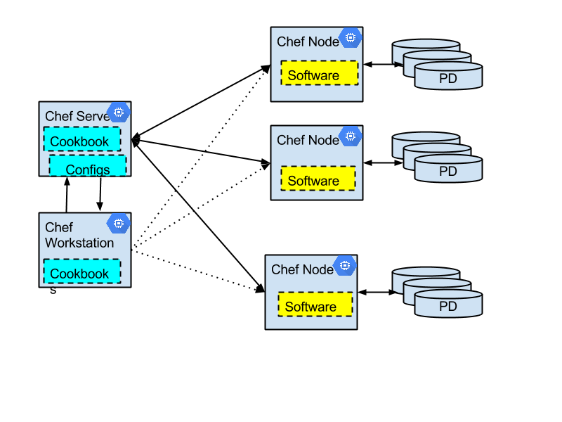

Deploy Chef on Google Compute Engine
====================================

Overview
--------

Google Compute Engine provides an elastic Linux environment to deploy
and run third-party software. For most standard
software packages, you can manually deploy and configure them using Linux
package managers and Linux Shell scripts. However, to automate your
deployment process, so that the deployment is re-deployable in different
environments, and easy to customize and manage, especially in a complicated
deployment, we resort to dedicated cloud management tools. On top of
Google Compute Engine, you have quite a few choices. You can choose to
use the native Google Cloud Manager (in Trusted Tester at the time of writing),
or you can use other popular open source software like Chef, Puppet etc.

In this document, we briefly explain how to run Chef with Google Compute Engine.
To set up a Chef management system, you need to create a Chef Server and
a Chef Workstation. Via the workstation, you can develop Cookbooks and
upload them to the server. In the same time, you can configure the chef
nodes that will be managed by the server. For each node, you can
configure the Cookbook recipes to be applied on the node. The Chef
server also provides a Web UI and you can do a lot of the configurations
via the Web UI.

The OpScode site contains very good documentation on general Chef
installation. Here are some instructions specific to Google Compute
Engine environment. It is suggested you try to update the Google Cloud
SDK on all Compute instances in your environment.

<code>
\> curl
https://dl.google.com/dl/cloudsdk/release/install\_google\_cloud\_sdk.bash
| bash
</code>

Install the Chef Server
-----------------------

Following the [instruction](http://www.getchef.com/chef/install/) to
download and install the server. The site only provides installers for
Enterprise Linux and Ubuntu. At the time of writing (Jan, 2014), Google Compute
Engine does not allow you to create those VM type yet. One solution is
to create a Debian VM and download the installer for Ubuntu (selecting
os version 11.04 instead of the 12.xx). If you choose to use CentOS VM,
you can follow [instruction](http://www.bonusbits.com/main/HowTo:Install_Chef_Server_on_CentOS).

After the installation, you can verify if the installation succeeds by
running “sudo chef-server-ctl test” or pointing your browser to
[https://x.x.x.x](https://x.x.x.x) where x.x.x.x is the public IP
address of the VM hosting your chef server.

-   Create a VM using Google Cloud Console or gcutil

-   Put the VM on a network with firewall setup to open TCP port 80,
    443, 4000, 9462

-   Follow [installation instruction from
    OpScode](http://docs.opscode.com/install_server.html) to install the
    Chef Server
-   Point your browser to the VM public IP address using HTTPS .

If you do not set the FQDN (Fully Qualified Domain Name) for the chef
server VM, it will have the default name like
“chef-server-name.c.cloud-solutions-gce.google.com.internal”. If you
want to access the chef server from a machine outside the VM network,
you can use the pubilc IP address of the VM instance. However, the
knife client talks with chef server using the FQDN. You need to map the
“chef-server-name.c.cloud-solutions-gce.google.com.internal” to the
public IP of the Chef Server VM in the “/etc/hosts” file.

Sample Installation on Debian 7

<code>
\> sudo apt-get update

\> curl -O
https://opscode-omnibus-packages.s3.amazonaws.com/ubuntu/11.04/x86\_64/chef-server\_11.0.10-1.ubuntu.11.04\_amd64.deb

\> sudo dpkg -i chef-server\_11.0.10-1.ubuntu.11.04\_amd64.deb

\> sudo chef-server-ctl reconfigure
</code>

Install the Chef Workstation
----------------------------

The OpScode site provides
[installers](http://www.opscode.com/chef/install/) for most operating
systems including all the VM types on Google Compute Engine. You can
easily download the installer and install the Chef client software. For
most systems, OpScode provides an system independent Omnibus installer:

<code>
\> sudo apt-get update

\> curl -L https://www.opscode.com/chef/install.sh | sudo bash
</code>

In some systems, it is also possible to do the installation of Chef Client using
specific package management systems, for example, using apt-get on
Debian.

### Setup Knife

Knife is installed as part of the Chef Client software. You could follow
[instruction](http://docs.opscode.com/install_workstation.html) to setup
knife configuration.

<code>
\> sudo apt-get install git

\> git clone git://github.com/opscode/chef-repo.git

\> knife configure --initial
</code>

### Setup Knife-Google Gem

It is suggested that you use
[knife-google](https://github.com/opscode/knife-google) gem as the knife
plugin for operations like Google Compute Engine instance creation. This
will automatically add the newly created instance as a Chef Node.

-   Install the gem
-   Run “knife google setup” to configure the knife plugin.

-   Get the project information and API access information from the
    [Google API Console](https://code.google.com/apis/console)

-   If you want to create instance using current user, for example,
    “user\_test”, make sure you use the following command line options

-   “knife google server create ... -i
    \~/.ssh/user\_test\_private\_ssh\_key -x user\_test …”
-   A simple use case using the current user, is to use the key “-i
    \~/.ssh/google\_compute\_engine”

<code>
\> sudo /opt/chef/embedded/bin/gem install knife-google

\> knife google setup
</code>
